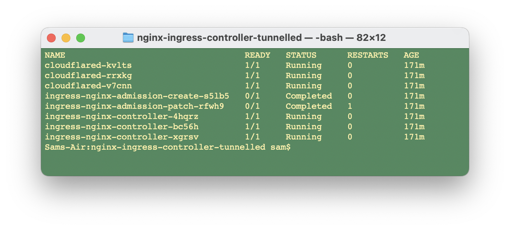
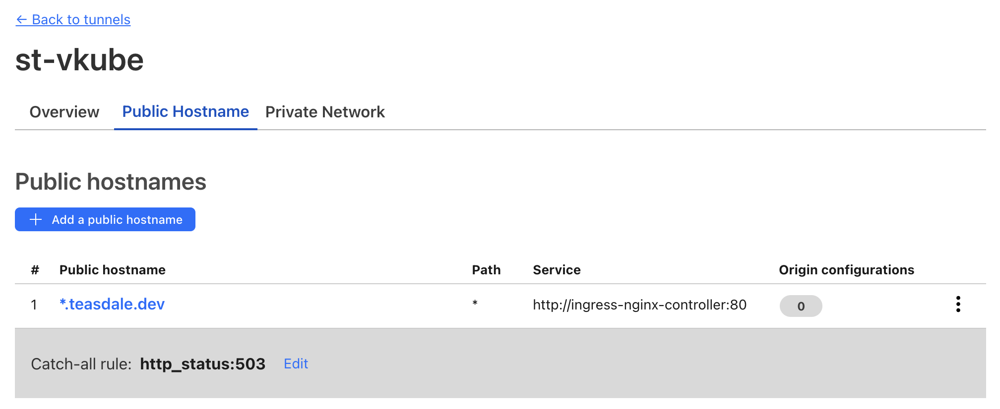
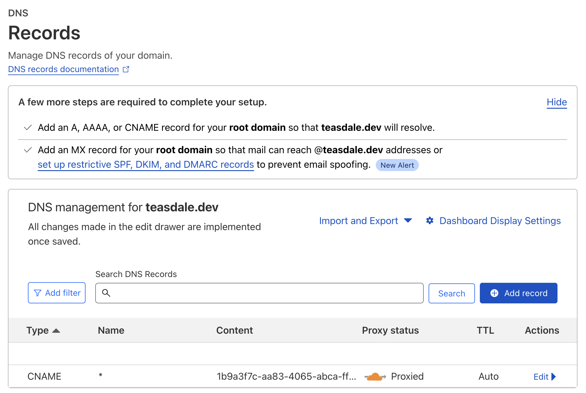

# Nginx Ingress Controller Tunnelled
Deployment file that deploys an Nginx Ingress Controller to the cluster along with [cloudflared](https://github.com/cloudflare/cloudflared).
Together, this combination allows external traffic into the cluster through CloudFlare tunnels (e.g without poking holes in the firewall).

Both the Nginx Ingress Controller _and_ `cloudflared` run as DaemonSets.  In the case of `cloudflared`, this means that 
[multiple, redundant tunnels](https://developers.cloudflare.com/cloudflare-one/connections/connect-apps/install-and-setup/deploy-cloudflared-replicas/) 
will be established between the cluster and CloudFlare network.

## Setup
There's a bit of up-front work required to get all of this working.  Many of the following steps came from [this guide](https://developers.cloudflare.com/cloudflare-one/tutorials/many-cfd-one-tunnel). 

### Prerequisites
* CloudFlare account with a registered domain (e.g. `teasdale.dev`)
* Kubernetes cluster that you can access via `kubectl`

### Install `cloudflared` Locally and Login
We'll need a **tunnel credentials file** to actually establish a tunnel.  The first step to generating this file is to
install `cloudflared` locally and use it to login to CloudFlare.

Install `cloudflared` on MacOs using Brew:
```bash
brew install cloudflared
```

Login:
```bash
cloudflared tunnel login
```

This'll open a tab on your default browser to the CloudFlare login page.  Login, follow the prompts, and pick the 
domain to associate any new tunnels with (e.g. `teasdale.dev`).

### Create the Tunnel
Use the following command to create the tunnel (substituting the proper tunnel name in the command):
```bash
cloudflared tunnel create st-vkube
```

This'll create a tunnel creds file in `~/.cloudflared/` that looks something `like 9944136a-df65-4b5b-b5f1-9006d6bf7b25.json`.
Take note of the full path of this file as you'll need it in the next step.

### Create Tunnel Credentials File Kubernetes Secret
Turn the tunnel credentials file created in the previous step into a Kubernetes secret.  Note that we're creating
this secret in the **ingress-nginx** namespace.  This is necessary because we're deploying `cloudflared` into the
same namespace.  Since that namespace won't actually exist until the [deploy.yml](./deploy/deploy.yaml) file is actually
deployed into the cluster, you may need to hold off on this step until _just_ after the [deploy.yml](./deploy/deploy.yaml)
file is deployed in the _next_ step.

Be sure to replace the path and name of the tunnel credentials file in the following command with the actual
path and name of the file created in the above step.

```bash
kubectl create secret generic tunnel-credentials \
--namespace=ingress-nginx \
--from-file=credentials.json=/Users/sam/.cloudflared/9944136a-df65-4b5b-b5f1-9006d6bf7b25.json
```

### Run the Deployment
Deploy the Nginx Ingress Controller and `cloudflared` to the Kubernetes cluster:

```bash
kubectl apply -f deploy
```

Create the tunnel credentials file secret from the previous step if you haven't already.  Maybe take a peek
at the pods and make sure that the ingress controllers and cloudflared instances have started up successfully.
Running `kubectl get pods -n ingress-nginx` should give you a list of pods that look similar to this:



### Create Tunnel Route & DNS Entry
Log into CloudFlare and navigate on over to the tunnels dashboard:  **Zero Trust -> Access -> Tunnels**.
You should see the tunnel that was created in the [Create the Tunnel](#create-the-tunnel) step above and,
if everything has gone correctly up to this point, the tunnel status should be **HEALTHY**.

Click on the tunnel name and then click **configured** to get to the tunnel configuration page.  If presented
with an option to migrate the tunnel, choose that option and follow all of the prompts until the tunnel is
successfully migrated.

Click on the **Public Hostname** tab.  Click on the **Add a public hostname** button.  On the resulting
**Public Hostname Page**,  create a hostname with the following values and save it:

| option | value |
| ------ | ----- |
| Subdomain | `*` |
| Domain | TLD (e.g. `teasdale.dev`) |
| Path | _leave blank_ |
| Type | `http` |
| URL | `ingress-nginx-controller:80` |

The tunnel configuration should now look like this:



Next, navigate out of the **Zero Trust** dashboard and over to the **DNS Records** dashboard for your TLD:
**Websites -> (your TLD) -> DNS** and create a wildcard DNS entry for the tunnel.  You'll need ID from the
tunnel credentials file created in the [Create the Tunnel](#create-the-tunnel) step above.  For example, if
the credentials file created in that step is `9944136a-df65-4b5b-b5f1-9006d6bf7b25.json`, then the ID is the
name of that file without the `.json` extension.

From the **DNS Records** page, click the **Add record** button and create a record with the following attributes
(replacing the tunnel ID in the following example with the actual ID of your tunnel) and save it:

| option | value |
| ------ | ----- |
| Type | `CNAME` |
| Name | `*` |
| Target | `9944136a-df65-4b5b-b5f1-9006d6bf7b25.cfargotunnel.com` |
| Proxy Status | _leave selected_ |

The DNS Records configuration should now resemble this:



And... well, that should about do it.  All traffic for `(site).teasdale.dev` should now get funneled through the
CloudFlare tunnel directly to one of the Ingress Controllers in the Kubernetes cluster.

## Next Steps
With the above infrastructure in place, the next step is to deploy an app or service to the cluster that includes
an ingress in the tunnel's TLD (e.g. `teasdale.dev`).  Make sure that the ingress has the following attribute:

    ingressClassName: nginx

You can find the matching **IngressClass** declaration in [deploy.yaml](./deploy/deploy.yaml) (just search for `IngressClass`).


